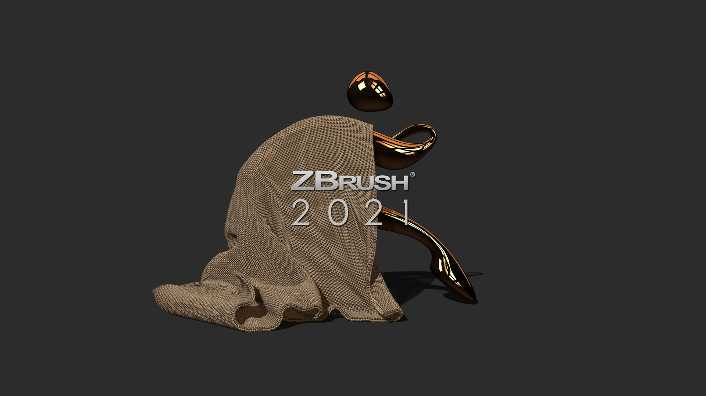
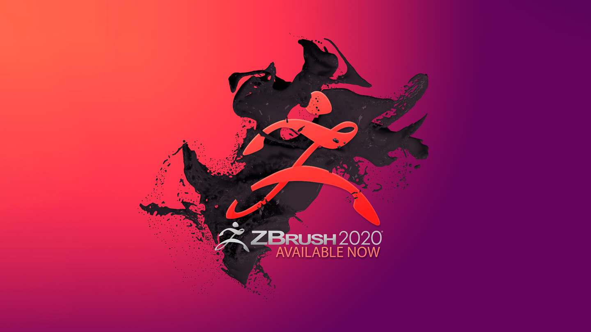
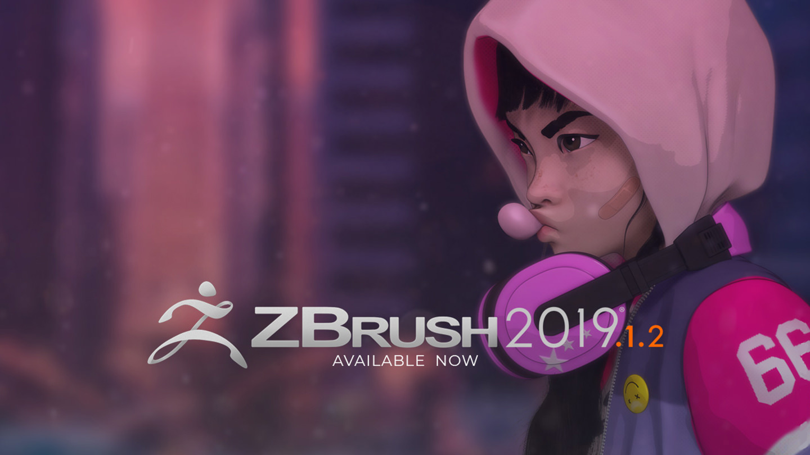

+++
date = "2020-10-01"
title = "ZBrush2021"
description = "Pixologic ZBrush更新..."
tags = [
    "ZBrush",
]

categories = [
    "ZBrush",
]
nomenu = "main"  
image = "ZBrush2021.jpg"  

+++

## 
ZBrush2021.1.2
 

### 2020-08-13

Pixologic is pleased to release ZBrush 2021.1.2. This important update to ZBrush 2021 includes the following:  

- Claypolish Surface adjusted
- Gizmo3D snap rotation updated
- Subtool renaming dialog box returned to normal size
- Fixed BPR NPR Filter render issue
- Resolved Dynamesh precision crash with subtractive elements
- Increased ZSketch stability
- Mask By Smoothness adjusted
- Fixed copy and paste issue with NanoMesh Subtools
- Fixed Document ‘Double’ stability issue
- Fixed Morph target causing shattered geometry
- ZModeler >> Poly >> Inset >> Polygroup Island should no longer crash with triangles
- Optimal performance updated to increase stability
- Weld Points adjusted
- NoiseMaker Angles now can be used in 45 degrees
- Preferences: >> Performance >> Optimal now stores with the config
- Locked custom interface buttons can now be removed
- Fixed issue involving canvas layers
- Directional masking issue resolved when using roll brushes
- Vertex Color issue resolved with OBJ import
- Gizmo3D screen space move stability improved
- 2.5D color spray simple brush issue resolved
- FBX export polypaint amended so that displays correctly in 3ds Max
- Alembic UVs merged on export
- Preferences >> GoZ display issue corrected
- Decimation Master now checks for Layer in record mode

## 
ZBrush2021.1.1
 
### 2020-08-22
- Resolved Spotlight jitter on Mac OS
- Micropoly directory restored on FL licenses
- GoZ pathing on Mac OS restored

## 
ZBrush2021.1
 
### 2020-08-21

### ADDED:

Preferences >> Tablet >> Tablet Driver API to determine how ZBrush works with Windows Ink, affecting performance when using a tablet on Windows.  
There are 3 options:
- WinTab (default mode): Will not handle Windows Ink. This will operate like it did in ZBrush 2019.  
- Stylus: Handles Windows Ink the same way it did in 2020.1.4.  
- WM_Event: Handles Windows Ink the same way it did in 2021.  

### Enhancements/Updates  
- Stability improved when using ‘Transpose Cloth’ and Firmness
- Preferences >> Gizmo 3D >> Tap to Exit Gizmo Mode now saves with Preferences >> Store Config
- Gizmo3D ‘Go to Unmasked Mesh Center’ now respects local symmetry
- Converting ZSpheres to adaptive skin no longer causes twisting on macOS
- ZModeler Point >> Move >> Snap to Surface will now save with custom ZModeler brushes
- SubTool function stability improved (scrolling, deleting, appending)
- Gizmo3D ‘Inflate’ functionality returned to 2020 settings
- Draw Draft Analysis rendering updated
- Improved Dynamic Subdivision Post SubDiv rendering
- Increased navigation speed when using models with PolyFrame and PolyPaint
- Transferring of texture detail to PolyPaint improved
- Improved SnapShot3D PolyGroup generation
- Plugin: Text 3D and Vector Shapes updated on macOS
- Plugin: TransPose Master updated

### REVERSIONS:
- TrimRect brush functionality returned to normal
- Pinch brush returned to 2020 settings
- Blob brush returned to 2020 settings

# 
ZBrush2021

### 2020-08-13
Pixologic is pleased to release ZBrush 2021. This new version will provide a number of powerful features that can revolutionize the way that you work!

### New Feature Highlights

- Introducing Dynamics
- Controlled Cloth Sculpting
- Dynamic Subdiv Revisited
- Performance
- ZModeler Upgraded
- Extrude Edge
- Equidistance Inset
- NanoMesh Modifications
- iMage 3D GIF and PNG Format

### Additional features:
  - Variable Cursor Size adjustment
  - ZModeler Point Move SnapToSurface Option has been added.
  - File extensions Collada (DAE) and Alembic (ABC) import/export capabilities
  - Stroke additions:
  - Jitter feature allows an alpha to bounce along a stroke path.
  - Imperfection feature applies a surface noise to the stroke.

***

## 
ZBrush2020.1.3
 

- Fixed: Pressure sensitivity when using Remote Desktop.
- Fixed: Pressure sensitivity when using mobile devices such as a Windows Surface device.

## 
ZBrush2020.1.1

### 2020-02-12  

### Updates & Fixes

- Fixed: Additional edit point added when holding Spacebar with any brush that makes use of the Ctrl+Shift combination. For example: Select Lasso, Clip brushes, Trim brushes, and CreaseCurve.
- Some minor adjustments to internal ZBrush functions.

## 
ZBrush2020.1

### 2020-02-05  

### Updates & Fixes  

- Fixed: ZBrush UI - Mac Finder Blurry Text & Icons.

- Fixed: Text box working in Japanese Windows with button Size set to <= 41.

- Fixed: Translated UI that cut SubTool info off in Japanese / Korean languages.

- Fixed: Size Sliders causing crash after changing size of a Project then reloading the Project.

- Fixed: Bracket ( ] ) increase draw size hotkey was broken (MacOS).

- Fixed: FiberMesh Curves OBJ Exporting was not creating OBJ (MacOS).

- Fixed: Mesh Turns Black While Layer in Record Mode

- Fixed: Tool:Masking:Go To Unmasked Center does not create an undo.

- Fixed: Ghost SubTool names would remain when loading another project.

- Fixed: ZAppLink Photoshop & PaintStop RGB Projection Errors.

- Fixed: Switching to the lower subdivision during recording mode on Layers, the model turns to black.

- Fixed: ZBrush would QuickSave a blank ZPR file that caused a crash.

- Fixed: History Recall does not work if Split Screen is enabled.

- Fixed: Slice Curve Brush to Morph UV mesh Crash.

- Fixed: ZModeler vertex snapping with smaller meshes.

- Fixed: Symmetry icons updating when switching from Local Symmetry to World Symmetry.

- Fixed: Interactive Light causing crashes.

- Fixed: Improved Mac fans issue on macOS.

- Added: A diagnostic utility to improve the submission and resolution of future bug reports.

- Updated: The Menus button has been placed back into the ZBrush UI.

- Updated: Projection Master shortcut is now Shift +G.

- Updated: Lasso Select brush will allow a larger selection.

- Update: FiberMesh with Subdiv will not render PolyFrame color with BPR.

- Updated: Size Sliders will only update if Enter is pressed.

- Updated: Clip, Slice and Trim brushes will no longer be able to be used when in Morph UV mode.

- Updated: Button Size Clips UI clipping (MacOS) with very large button size(>90).

- Updated: User can now define colors for Draft Analysis.

- Updated: When renaming SubTools the first letter will no longer be capitalized automatically.

- Plugin Updates:
    - ExportImport
        - Fixed camera import error messages
        - Improved support for more than one display on macOS
    - Decimation Master
        - Fixed path issue that affected some users on Windows
    - Left and Right tray macro
        - Right tray macro updated to open/close right tray.
    - Polygroupit
        - Will now launch on MacOs 10.15 (Catalina)
    - UV Master
        - Automatically selects Paint brush for control painting
    - ZBrush to Photoshop
        - Resolved Subtool layer issue
    - 3D Print Hub
        - Updated 3DPrintHubAbout.PSD file
    - SubTool Master
        - Removed stray button in DoVisible options
    - PaintStop
        - Restored hiding of the top menus
    - GoZ for Maya (Win/Mac)
        - Support for Maya2020
    - GoZ Installer
        - Support for Maya2020

# 
ZBrush2020

### 2019-11-13

Pixologic is pleased to announce the release of ZBrush 2020! This new version enables artists with greater sculpting flexibility via powerful additions to the award winning brush system, as well as significant enhancements in a number of other areas.

### New Feature Highlights

- XTractor Brushes - Convert detail from your model into a new alpha or texture for reuse elsewhere.
- HistoryRecall Brush - Project a model’s Undo History to another model regardless of topology differences.
- Sculpt & Paint in Morph UV - You can now paint and even sculpt directly on a model’s flattened UV shell.
- Move Infinite Depth - Affect anything that is directly inline with the brush cursor, no matter how far from the camera.
- Texture Adjust Color - Adjust the colors in a model’s texture on the fly, modifying hue, intensity, contrast, gamma or tint.
- PolyPaint Adjust Color - Same as above, but for PolyPaint. These features include eight color channels to easily restrict your changes to certain areas.
- Wall Thickness Analysis - Instantly know what parts of a model are too thin for successful 3D printing, or thicker than necessary.
- Real-Time Draft Analysis - Easily identify and fix portions of the model that would lock up when used in two part molding or CNC printing.
- Calculate Surface Area - ZBrush can now provide you with the bounding box size, mesh volume and surface area, check for watertight integrity and help calculate real-world material needs.
- Cam View - Always know how your model sits relative to XYZ space. Includes one-click buttons for snapping to orthagonal views.
- Real-Time Silhouette View - Turn on a picture-in-picture window that displays your model’s silhouette in real-time, or see how it “reads” from a distance.
- ZeeZoo - Mannequins have gone wild, with a library of animal figures to help you compose scenes of all kinds.
- Deco Curve Brush - The classic Deco Brush for 2.5D painting is now available as a 3D sculpting brush.
- Model Paint Fade Opacity - If a model’s PolyPaint or texture is making it hard for you to see the sculpted details you can now partially fade the color or even hide it altogether.
- No Back & Forth Mode - Zigzagging brush strokes can now build up in one direction, only. This mode also combines with LazyMouse Backtrack for unique effects.
- New Import/Export Options Window - Easier control when importing or exporting and support for even more formats, all in one place.

***

## 
ZBrush2019.1.2

### 2019-05-31
This update includes the following improvements, mostly affecting Split Screen mode:  
Activating Solo while in Split Screen no longer causes screen artifacts.  
Duplicating a SubTool while in Split Screen no longer causes drawing artifacts.  
There are no longer camera issues when drawing a selection rectangle and pressing spacebar.  
Rendered curves are now clipped to the Split Screen region.  
Split Screen now respects Dynamic Subdivisions.  
An issue with tessimation smoothing a masked mesh has been resolved.  

## 
ZBrush2019.1

### 2019-05-23
ZBrush 2019.1 is now available as a FREE update for all users. We strongly recommend upgrading at the earliest opportunity.    
It includes several new features as well as a number of enhancements or fixes within both the ZBrush feature set and various plugins. Please see the list below for more information.  
### Feature additions  
ZBrush 2019.1 introduces several additions to both improve workflow and enhance your ZBrush experience:  

- A new split mode, which isolates the current SubTool from all others, displaying them on separate sides of the screen. See it in action with the video below!  

- A Screensaver has been added which (after a predefined amount of time) will display curated images straight from the ZBrushCentral.com 20 community. Unlike your operating system screensaver, this one will only affect the ZBrush application window.  

- A new “Groups Intersection” mode has been added to the Smooth Brush Modifiers.  

- GoZ has been updated with support for Adobe Photoshop® 2019, Autodesk Maya 2019 and Autodesk 3DS Max 2020.  

- The FBX format now supports up to 64 cameras at import and export. Imported cameras are listed in the Camera selection list in the Draw palette. FBX will now support up to FBX 2019.  

### Plugins  
Several plugins have been updated to support 2019 additions as well as for stability and performance improvements:  

- SubTool Master, with a new Show Hidden Points function.  

- ZAppLink  

- Scale Master  

- 3D Print Hub, with better handling of large STL files and support for more STL formats on import.  

- Intersection Masker  

- FBX Import/Export  

- ZBrush to Photoshop  

- ZColor  

- Decimation Master  

- Image Plane  

### Improvements  
Below are some of the improvements or behavior changes made with ZBrush 2019.1:  

- A pop-up message is now displayed when exiting Edit mode, asking for confirmation.  

- SubTool folders now support Move Up and Move Down functions.  

- SnapShot 3D with reference images will no longer apply a DynaMesh Boolean process. (Pressing ‘Sub’ is now required for the SpotLight image to be cut out of the DynaMesh surface.)  

- Updated keyboard shortcuts for macOS to now create a Folder with Command+F.  

- Updated keyboard shortcuts for macOS to go full screen with Command+Ctrl+F rather than   creating a new folder.  

- Saving and loading files across a network have been improved.  

### Stability and Fixes:  
Several issues raised by our users or beta testers have been fixed in the 2019.1 release:  

- Ctrl+Shift brushes no longer jump when holding Space Bar.  

- Assigning a hotkey now gives a warning if the hotkey is already in use.  

- Snapshot 3D snapping points now respects canvas Zoom.  

- Support has been added for .jpeg and .tiff image file extensions.  

- Total Points Count display has been improved.  

- Improved Boolean generation.  

- Crease Level slider will update results when Dynamic Subdivision is enabled.  

- Dots display mode is now disabled when Transparency mode is active.  

- Improved stability of the Surface Noise editor.  

- Improved stability when switching rapidly between Edit and Move modes.  

